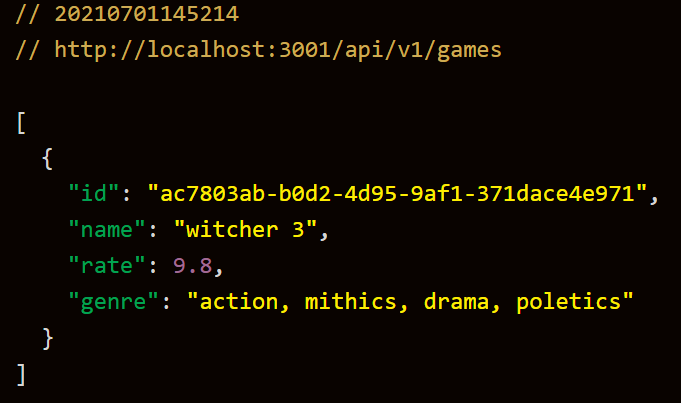
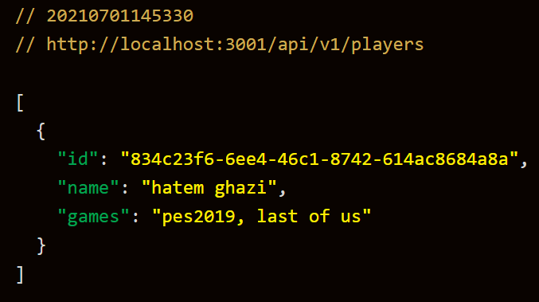
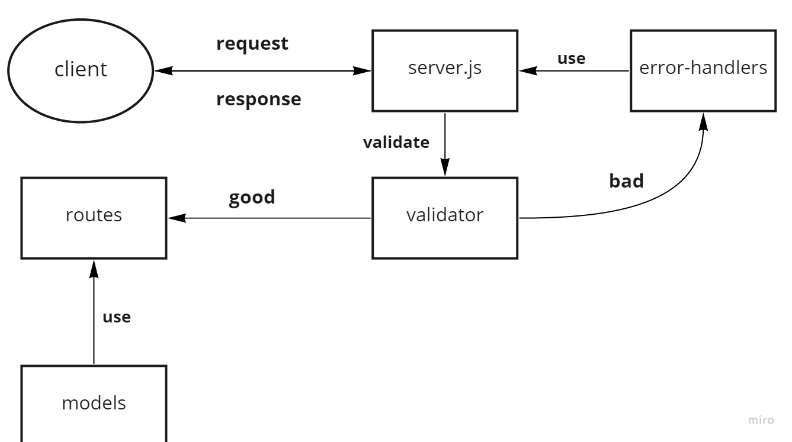

# cloud-server

### Author : Hatem Husnieh  && Murad Al-Shorman

## install  
1. copy the link of the repo
1. clone the repo on your local machine by `git clone repo-url`
1. download independencies by `npm i`
1. create a `.env`, then cope the content of `.env.sample` file inside the `.env` file.
1. fill the variables of `.env`
1. run the app  

## Process  
- This application is made as a lab work for LTUC and codeFellows scholarship.  
- This application is deployed on `aws` through `Elastic Beanstalk` on an educational account.
- This application was made through pair programming.

## Deploy, Run and Test
- [test report](https://github.com/Hatemhusnieh/cloud-server/actions)
- [deployed link](http://awscloudservers-env.eba-cpmgmtfy.us-east-1.elasticbeanstalk.com/)
- [Pull Request](https://github.com/Hatemhusnieh/cloud-server/pull/1)

### Setup  
#### `.env` requirement
  - `PORT` - port number  

#### Running the app  
- either:
  1. `npm start`
  1. `nodemon`
- Endpoint: `/api/v1/games`
  - returns Object  

      

- Endpoint: `/api/v1/players`
  - returns Object  

      
      
#### Test 
- Unit test: `npm run test`
- Lint test: `npm run lint`

### UML:  
